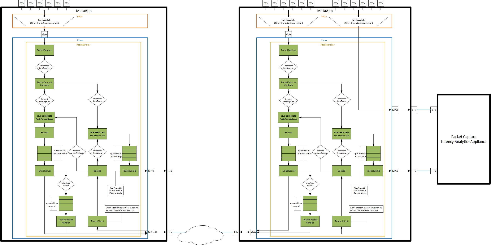

# Overview
PacketBroker is a network packet capture, aggregation, and forwarding solution for moving network packets of any protocols to a centralized location for persistence and analysis.
It is designed to run in the following devices to perform packet encapsulation, aggregation, and transport:
* Inside timestamping switches such as the [Metamako MetaApp 32](https://www.metamako.com/products/metaapp-32.html) which does tapping, timestamping, and aggregation.
* On commodity servers with packet capture and timestamping cards such as the [Solarflare SFN8522PLUS](https://www.solarflare.com/Media/Default/PDFs/SF-116323-CD-LATEST_Solarflare_SFN8522-PLUS_Product_Brief.pdf) which does the timestamping.

# Features
* Move packets from one interface to another local interface or to a remote location.
* Connect to multiple remote edge nodes to receive packets captured from remote locations and aggregate with packets captured locally.
* Multiple hop forwarding through intermediate nodes is supported if a direct end to end connection is not permitted due to network security requirements.      
* Prepend packets with a header identifying original source node and intermediate nodes with sequence numbers, timestamps, and configurable descriptions.
* Support jumbo frames with MTU (9000 bytes) + Ethernet FH (14 bytes) + Original FCS (4 bytes) and any configurable number of trailer based timestamps of any given sizes, useful when packets have been cross fed through multiple timestamping switches.
* Lightweight non blocking design with one thread serving multiple remote consumer nodes. 
* Handle slow or dead remote nodes by resending packets for a configurable time before placing on Dead Letter Queue.

# Alternatives and issues
Traditional approach typically involves either of the following setup.
* Use a single high performance switch to do switching, tapping, timestamping, and tunneling over SPAN.
* Use an inline tap and a dedicated switch to do just timestamping and tunneling over SPAN.

Both suffers from a number of issues, most obviously the inability of most switches to utilize all ports due to loading.  Following is a list of additional issues with these approaches. 

## SPAN
Most enterprise switches support SPAN / monitor sessions whereby packets traversing through selected ports can be redirected to another port typically connected to a device performing timestamping and packet capture.
For latency monitoring in financial trading whereby solutions such as Velocimetrics or Corvil appliances are deployed this necessitates one appliance per rack.
Another issue with SPAN is the technology was designed for troubleshooting and occasionally suffers form packet drops.

## GRE / ERSPAN
While ERSPAN supports receiving packets from remote switches which alleviates the need to deploy multiple remote monitoring appliances it uses GRE as a protocol for transport which does not guarantee delivery with packets arriving in order.
The [Cisco N7K config guide](https://www.cisco.com/c/en/us/td/docs/switches/datacenter/sw/5_x/nx-os/system_management/configuration/guide/sm_nx_os_cg/sm_erspan.html) is a good read but there are lots of restrictions with this approach such as:
* A small number (eg 2) ERSPAN source sessions can only run simultaneously despite being able to configure many (eg 48).
  This may be higher for newer switch firmware versions but is still generally much lower than available ports on the switch.
* Aggregation from multiple source devices to one destination port is not supported.
* No support for L2 trunk or L3 subinterfaces as source sessions.
* Performance impact to some switches potentially impacting packet forwarding and routing.

## Linux TUN / TAP
This is an excellent built in feature for replicating packets efficiently to remote locations but does not work if trailer based timestamps are applied which simply replaces the original Frame Check Sum with the timestamp as such packets will be dropped by the Linux network stack as a malformed packet.

# Example Implementation
Following diagram illustrates how it can be used on the Metamako MetaApp 32, highlighting how the configuration parameters in configs/defaults.conf influences how packets are to be processed.

# License
Apache License 2.0
